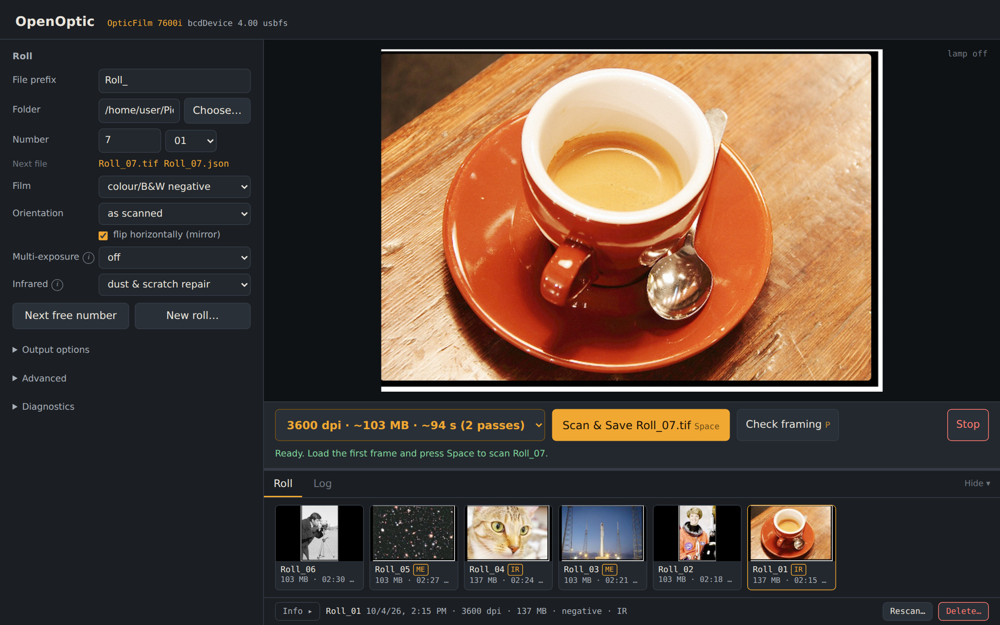
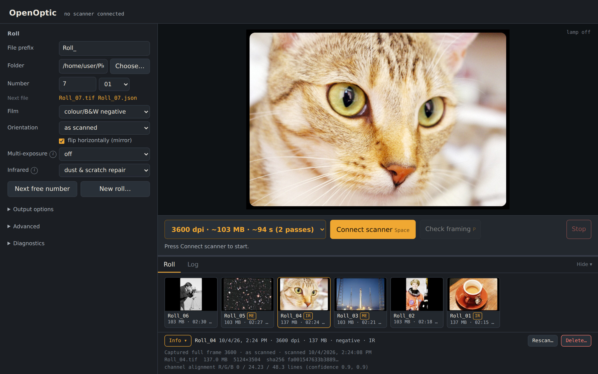
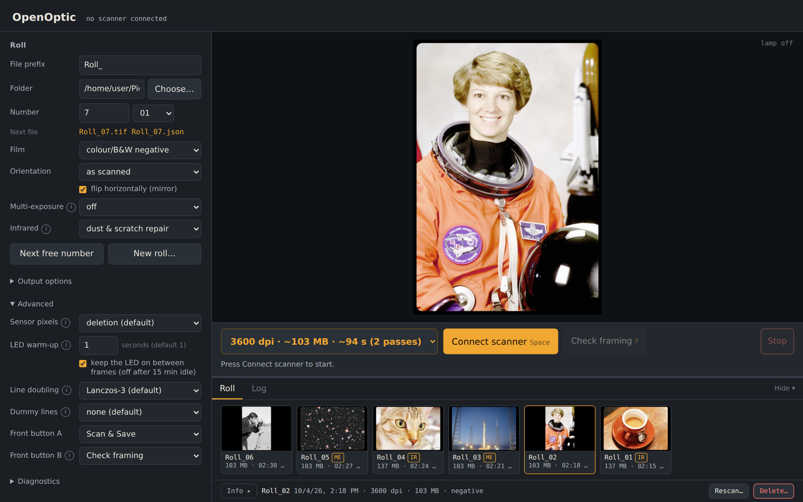

# OpenOptic

**OpenOptic is a free, high-fidelity raw negative film scanning suite for your Plustek OpticFilm
7600i, entirely within your browser.**

Run the standalone app and your browser becomes a roll-scanning workstation. There's no
driver to install, no licence to buy and nothing to configure. You get clean, linear 16-bit scans
of your negatives, ready to invert in the tool you already like.

[](https://github.com/bazfp/OpenOptic/actions/workflows/ci.yml)
[](LICENSE)



## Features

- **Raw linear TIFF negative export**: 16-bit-per-channel linear scans with no inversion,
  curves or colour "correction" baked in. Exactly what negative converters want.
- **Integrated dust and scratch removal**: an infrared pass finds dust, hairs and scratches and
  repairs them with texture-aware inpainting that keeps the film grain. The infrared channel is
  also saved inside the TIFF, and a toggle shows exactly what was repaired.
- **Multi-platform**: Windows, macOS (Apple silicon and Intel) and Linux (x64 and ARM, including
  Raspberry Pi 4/5). One self-contained file per system; no driver changes on Windows or macOS.
- **Maximum sensor scan size**: the full native resolution of the sensor, 7200 dpi (about
  10,248 × 7,009 pixels, 72 megapixels per 35 mm frame), plus 3600 and 1440 dpi.
- **Fast scans**: a 3600 dpi frame in about 40 seconds, roughly twice as fast as SilverFast's
  default timing.
- **Live previews**: watch the frame appear line by line as it scans, with a quick framing check
  before you commit, and a high-quality preview of every saved frame.
- **Multiple exposure support**: a second, longer exposure pulls clean detail out of dense
  negatives. Choose an extended-range linear merge (for negative converters) or an HDR-style
  exposure fusion.
- **Photo roll management**: dated roll folders, automatic frame numbering, a filmstrip of the
  whole roll, a JSON record of every scan, and rescans that never silently overwrite.
- **Scanner button support**: scan a whole roll without touching the computer! Slide the
  holder to the next frame and press the scanner's front button: the frame is scanned,
  saved and numbered for you.
- **Sub-pixel colour alignment** and high-quality Lanczos resampling for sharp, fringe-free
  images, and correction for the sensor's staggered columns at 7200 dpi.
- **Free and open source**: MIT-licensed, no subscriptions, no watermarks, no locked features.

## Getting started

### 1. Download

Get the file for your system from the [Releases](https://github.com/bazfp/OpenOptic/releases)
page:

| System | File |
|---|---|
| Windows (most PCs) | `openoptic-windows-x64.exe` |
| Windows on ARM | `openoptic-windows-arm64.exe` |
| Mac with Apple silicon (M1 or later) | `openoptic-macos-apple-silicon` |
| Intel Mac | `openoptic-macos-intel` |
| Linux PC | `openoptic-linux-x64` |
| Linux ARM (Raspberry Pi 4/5, 64-bit) | `openoptic-linux-arm64` |

### 2. Run it

Close SilverFast or any other scanning software first: only one program can use the scanner at
a time.

- **Windows**: double-click the `.exe`. Your existing Plustek driver is fine. Because the file
  isn't code-signed, SmartScreen may warn the first time: click **More info → Run anyway**.
- **macOS**: the file is unsigned, so remove the download quarantine once in Terminal:

  ```sh
  cd ~/Downloads
  chmod +x openoptic-macos-apple-silicon
  xattr -d com.apple.quarantine openoptic-macos-apple-silicon
  ./openoptic-macos-apple-silicon
  ```

- **Linux**: `chmod +x openoptic-linux-x64` and run `./openoptic-linux-x64`. If your user
  can't open the scanner, it prints the one command that fixes it.

Your browser opens the OpenOptic page. Keep the small console window open while you scan; close
it (or press Ctrl+C) to quit.

### 3. Scan a roll

1. Press **Connect scanner**.
2. In the **Roll** section, check the folder (by default `~/Pictures/OpenOptic/<today's date>`)
   and choose a resolution. 3600 dpi is a great everyday choice.
3. Load the film holder, press **Check framing** to see the frame, then press **Space** to scan
   and save. You don't need the keyboard: the scanner's **top button** does the same as Space,
   and the **bottom button** runs Check framing.
4. Slide to the next frame and press again. Each frame is saved as `Roll_01.tif`,
   `Roll_02.tif` and so on, with a matching `.json` record, and appears in the filmstrip.

### 4. Invert your negatives

OpenOptic deliberately saves the **raw negative**: linear, uninverted and orange mask intact. That
leaves all the creative decisions to a dedicated converter, which does a far better job than
any fixed inversion:

- **darktable** with its **negadoctor** module (free).
- **Negative Lab Pro** for Adobe Lightroom Classic.
- **RawTherapee**'s Film Negative tool (free).

Import the TIFFs as you would any scan. Tip: leave a sliver of unexposed film base at the edge of
the frame; converters use it to neutralise the orange mask.

## Screenshots

Every saved frame gets a full-size preview, with its record a click away:



Portrait frames are rotated for you, and the advanced options (sensor sampling, line doubling,
front-button actions) sit tucked away until you want them:



The [user guide](docs/USER_GUIDE.md) covers every option in detail.

## Why TIFF and not DNG or a raw format?

A camera's raw file exists because a camera sensor sees only one colour per pixel through a
mosaic filter. The "raw" step of converting that mosaic into full colour (demosaicing) is left
for later, and DNG is a container for that undeveloped data.

A film scanner doesn't work that way. The OpticFilm's sensor has three full lines of red, green
and blue cells, so **every pixel is measured in all three colours directly**. There's no mosaic
and nothing left to demosaic. The scanner's equivalent of "raw" is simply the linear,
unprocessed sensor values, and a 16-bit linear TIFF stores exactly that, losslessly:

- **Nothing is lost.** OpenOptic writes the sensor's values after only the calibration the
  hardware itself needs (shading and black level) and the colour-line alignment, with no gamma,
  curves, sharpening or colour profile applied.
- **Everything reads it.** darktable, Negative Lab Pro, RawTherapee, Lightroom, Photoshop,
  GIMP, Affinity: linear 16-bit TIFF is the universal format for film scans. Scanner "DNG"
  files are linear DNGs that only some converters handle well.
- **It can carry the infrared channel.** The dust-and-scratch infrared data is stored as a
  fourth TIFF channel next to RGB, the same layout as SilverFast's 64-bit "HDRi" files. Programs
  that only read RGB just ignore it.
- **It's an open, documented format** that will still open in decades, with no proprietary
  container or vendor software needed.

## Supported scanners

| Scanner | Status |
|---|---|
| **Plustek OpticFilm 7600i**, first hardware version (GL843) | ✅ Supported |
| OpticFilm 7600i, later hardware version (GL845) | ❌ Not yet supported |
| OpticFilm 8200i | ❌ Not yet supported |
| Other OpticFilm models (7200, 7300, 7400, 7500i, 8100, 8300i …) | ❌ Not yet supported |

**Which 7600i do I have?** The 7600i has been sold under several names (7600i, 7600i SE, 7600i
Ai) that differ in the bundled software. What matters is the electronics inside. Plustek has
built the 7600i around two different scanner chips from Genesys Logic, and the scanner reports
which version it is as its USB device revision (`bcdDevice`):

- **bcdDevice 4.00**: the first version, built on the **Genesys Logic GL843**. This is the one
  OpenOptic supports.
- **bcdDevice 6.05**: a later version built on the newer **GL845**. OpenOptic recognises it and
  refuses to drive it rather than risk the hardware.

OpenOptic shows the revision when you press Connect. On Linux, `lsusb -v -d 07b3:0c3b | grep
bcdDevice` shows it too.

**Why only one chip?** OpenOptic drives the scanner at the lowest level: register settings,
motor tables, lamp and calibration for each scan mode, all tuned and validated for the GL843 in
the 7600i. Every chip has its own register map, and every model has its own sensor, optics and
motor, so each needs its own validated profiles.

**The 8200i and the GL845.** The OpticFilm 8200i is built on the **GL845**, the same chip as the
later 7600i (the 8200i SE is built on the newer **GL128** instead). The GL845 is a close
relative of the GL843, so most of OpenOptic carries straight over: the browser app, roll
management, previews, multi-exposure, infrared repair and the USB helper. Supporting it needs
GL845 scan profiles and a validation pass on a real scanner, which would also unlock the later
7600i. If you'd like to see your scanner supported, **please [get in
touch](https://github.com/bazfp/OpenOptic/issues)**. Owners willing to run a few test captures
are exactly what's needed.

## Status

OpenOptic is a hobby project and is not affiliated with or endorsed by Plustek or LaserSoft
Imaging. "OpticFilm", "SilverFast" and "iSRD" are trademarks of their respective owners.
OpenOptic drives the scanner's motor and lamp directly. It has been developed and tested on one
scanner, and you use it at your own risk.

Bug reports and feature requests are welcome on the
[issue tracker](https://github.com/bazfp/OpenOptic/issues).

## For developers

Requires **Go 1.24+** and, for the tests, **Node.js 20+**.

```sh
make build   # ./openoptic for this system
make dist    # all six release binaries into dist/
make test    # Go tests and the JavaScript test suite
```

A small Go helper handles USB and file access and serves the page; all scanning logic and image
processing run in the browser. To try it without a scanner, open **Diagnostics → Dry run** on
the page.

| Document | Contents |
|---|---|
| [User guide](docs/USER_GUIDE.md) | Setup on every system, every option, and how the processing works |
| [docs/PROTOCOL.md](docs/PROTOCOL.md) | The scanner's USB protocol: registers, status bits, motor, geometry, events |
| [docs/DESIGN_MULTIEXPOSURE_AND_IR.md](docs/DESIGN_MULTIEXPOSURE_AND_IR.md) | Design and validation of multi-exposure and infrared repair |
| [docs/CAPTURE_FINDINGS_COLOUR_ME_IR.md](docs/CAPTURE_FINDINGS_COLOUR_ME_IR.md) | Colour-film, multi-exposure and infrared measurements |
| [docs/CAPTURE_VALIDATION.md](docs/CAPTURE_VALIDATION.md) | Acquisition baseline and validation |
| [docs/CHANGES_AND_FINDINGS.md](docs/CHANGES_AND_FINDINGS.md) | Development log |

## Credits

The photos in the screenshots are from scikit-image's sample data, scanned as demonstration
negatives: coffee by Rachel Michetti (CC0), Chelsea the cat by Stefan van der Walt (CC0), the
cameraman by Lav Varshney (CC0), astronaut Eileen Collins (NASA, public domain), the Falcon 9 DSCOVR
launch (SpaceX, public domain) and the Hubble eXtreme Deep Field (NASA, public domain).

## License

[MIT](LICENSE) © bazfp
